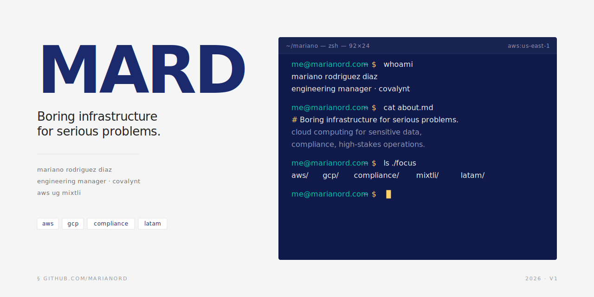

# Mariano Rodríguez Díaz · `marianord`

> Boring infrastructure for serious problems.

**Engineering Manager @ Covalynt** · **AWS UG Mixtli Leader** · Cholula, México 🇻🇪🇲🇽

I build and operate cloud platforms for environments where mistakes are
expensive. Sensitive data, compliance, audit trails, customers where a
compliance failure isn't just a fine, it's a headline.

Originally from Venezuela, based in Mexico, with a regional Latin American
perspective on cloud.

## What I write and talk about

* 🔧 **Boring infrastructure** — choosing predictable, well-understood
  technology in a world that rewards novelty.
* 🛡 **Cloud engineering in regulated environments** — SOC 2, ISO 27001, CyberEssentials+, audit trails, PII at scale.
* 👥 **Engineering leadership** — the quiet decisions that compound.
* 🌎 **Cloud from the Latin American tech diaspora** — billing in USD,
  cross-country on-call, hiring senior talent across the region.

## Currently

* Leading the Infrastructure team at [Covalynt](https://covalynt.com).
* Organizing meetups with [AWS UG Mixtli](https://www.meetup.com/awsugpue/).
* Writing in English, speaking in Spanish.
* AWS Certified · Working primarily with GCP/GKE at work, AWS in personal projects.

## Where to find me

* 🌐 [marianord.com](https://marianord.com) — long-form writing
* 💼 [LinkedIn](https://www.linkedin.com/in/marianord/) — main channel
* 🎤 [Sessionize](https://sessionize.com/marianord/) — speaker profile
* ☁️ [AWS Builder Center](https://builder.aws.com/community/@marianord) — `@marianord`
* 🦋 [Bluesky](https://bsky.app/profile/marianord.com) — `@marianord.com`
* 🗣 [Twitter/X](https://x.com/marianord58) — `@marianord58`

---

If your infra is exciting, something is wrong.